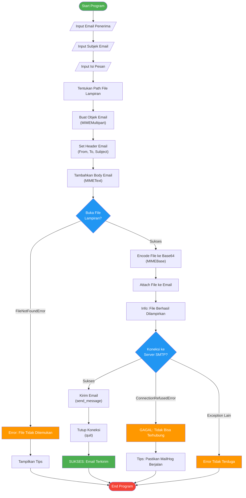
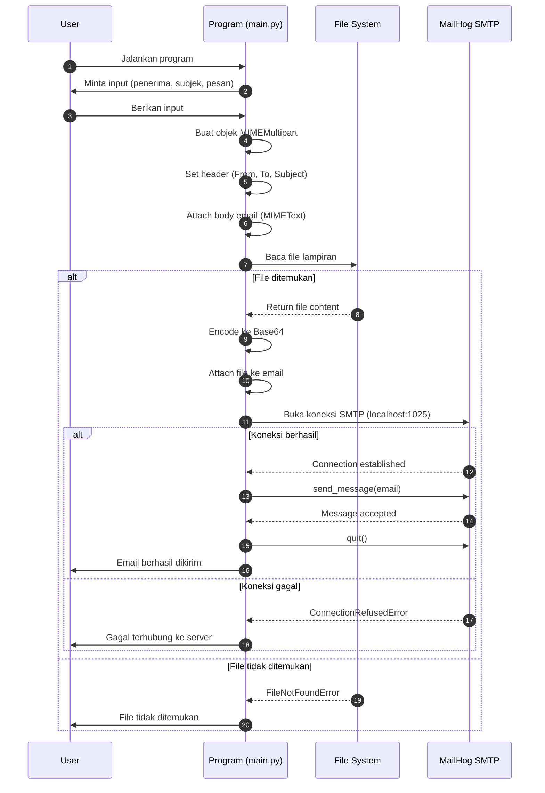
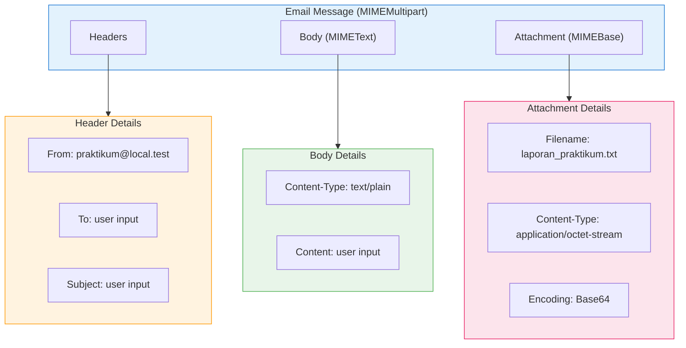

# Program Pengirim Email SMTP

Program Python untuk mengirim email dengan lampiran menggunakan protokol SMTP ke server MailHog.

## Deskripsi

Program ini adalah implementasi sederhana dari client SMTP yang memungkinkan pengguna untuk:
- Mengirim email dengan alamat penerima, subjek, dan isi pesan yang dinamis (input dari terminal)
- Melampirkan file `laporan_praktikum.txt` secara otomatis
- Terhubung ke server MailHog sebagai SMTP server lokal untuk testing

## Requirements

- **Python 3.x**
- **MailHog** - Server SMTP lokal untuk testing email

### Instalasi MailHog

```bash
# Menggunakan Go
go install github.com/mailhog/MailHog@latest

# Atau download binary dari releases
# https://github.com/mailhog/MailHog/releases
```

## Konfigurasi

| Parameter | Nilai Default | Deskripsi |
|-----------|---------------|-----------|
| `SMTP_SERVER` | `localhost` | Alamat server SMTP |
| `SMTP_PORT` | `1025` | Port SMTP MailHog |
| `EMAIL_PENGIRIM` | `praktikum@local.test` | Alamat email pengirim |

## Cara Menjalankan

1. **Jalankan MailHog terlebih dahulu:**
   ```bash
   mailhog
   ```
   MailHog akan berjalan di:
   - SMTP: `localhost:1025`
   - Web UI: `http://localhost:8025`

2. **Pastikan file lampiran tersedia:**
   ```bash
   # Jika belum ada, buat file lampiran
   touch laporan_praktikum.txt
   
   # Isi dengan konten (opsional)
   echo "Isi laporan praktikum" > laporan_praktikum.txt
   ```

3. **Jalankan program:**
   ```bash
   python main.py
   ```

4. **Ikuti prompt di terminal:**
   ```
   === PROGRAM PENGIRIM EMAIL ===
   Masukkan Email Penerima: recipient@example.com
   Masukkan Subjek Email: Test Email
   Masukkan Isi Pesan: Halo, ini adalah pesan testing.
   ```

5. **Cek email di MailHog Web UI:** Buka `http://localhost:8025`

## Struktur File

```
praktikum-smtp/
├── main.py                   # Program utama pengirim email
├── laporan_praktikum.txt     # File lampiran yang akan dikirim
├── Slide_SMTP_POP3.pdf       # Materi referensi SMTP/POP3
└── README.md                 # Dokumentasi ini
```

## Komponen Utama Program

### 1. Import Library
- `smtplib` - Library standar Python untuk komunikasi SMTP
- `email.mime.*` - Untuk membuat struktur email multipart (body + attachment)
- `os` - Untuk operasi file system

### 2. Fungsi `kirim_email_dinamis()`
Fungsi utama yang menangani keseluruhan proses pengiriman email:
- Menerima input dari user (penerima, subjek, isi pesan)
- Membangun objek email dengan struktur MIME
- Menambahkan lampiran file
- Mengirim email melalui koneksi SMTP

## Alur Kerja Program (Flowchart)



## Diagram Sequence Pengiriman Email



## Diagram Struktur Email MIME



## Penanganan Error

| Error | Penyebab | Solusi |
|-------|----------|--------|
| `FileNotFoundError` | File `laporan_praktikum.txt` tidak ada | Buat file dengan `touch laporan_praktikum.txt` |
| `ConnectionRefusedError` | MailHog tidak berjalan | Jalankan `mailhog` di terminal terpisah |
| Exception lainnya | Berbagai penyebab | Cek pesan error untuk detail |

## Referensi

- [Python smtplib Documentation](https://docs.python.org/3/library/smtplib.html)
- [Python email.mime Documentation](https://docs.python.org/3/library/email.mime.html)
- [MailHog GitHub Repository](https://github.com/mailhog/MailHog)
- [RFC 5321 - Simple Mail Transfer Protocol](https://tools.ietf.org/html/rfc5321)

---

> **Catatan:** Program ini ditujukan untuk keperluan praktikum dan testing. Untuk penggunaan produksi, pertimbangkan penggunaan autentikasi SMTP dan enkripsi TLS.
