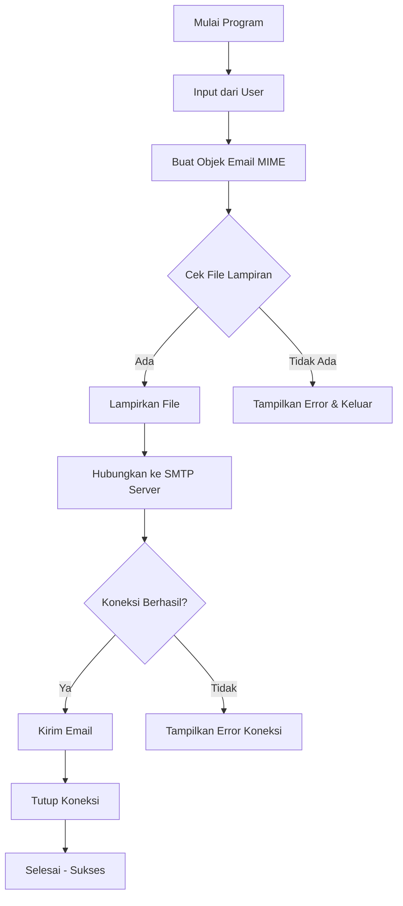

# 📧 Dokumentasi Program SMTP MailHog

> **Panduan Lengkap untuk Memahami Program Pengirim Email**

---

## 📑 Daftar Isi

1. [Pendahuluan](#pendahuluan)
2. [Konsep Dasar Python](#konsep-dasar-python)
3. [Penjelasan Kode Blok per Blok](#penjelasan-kode-blok-per-blok)
4. [Alur Kerja Program](#alur-kerja-program)
5. [Daftar Variabel](#daftar-variabel)
6. [Daftar Fungsi](#daftar-fungsi)
7. [FAQ untuk Presentasi](#faq-untuk-presentasi)

---

## Pendahuluan

Program ini adalah **Email Client sederhana** yang mengirim email melalui server **MailHog** (SMTP testing tool). Program dibuat menggunakan Python dan memanfaatkan library bawaan untuk menangani protokol SMTP dan format email MIME.

### Teknologi yang Digunakan

| Komponen | Deskripsi |
|----------|-----------|
| **Python** | Bahasa pemrograman utama |
| **smtplib** | Library untuk koneksi SMTP |
| **email.mime** | Library untuk format email |
| **MailHog** | Server SMTP untuk testing |

---

## Konsep Dasar Python

### 1. `def` (Definition)

**Pengertian:** `def` adalah keyword Python untuk **mendefinisikan/membuat fungsi**.

```python
def kirim_email_dinamis():    # ← Ini adalah DEF
    # isi fungsi
```

**Struktur:**
```python
def nama_fungsi(parameter):
    # isi fungsi (harus indent)
```

---

### 2. Argument (Argumen)

**Pengertian:** Argumen adalah **nilai yang diberikan ke fungsi saat dipanggil**.

**Contoh dalam kode:**

```python
# Fungsi print() menerima argumen berupa string
print("=== PROGRAM PENGIRIM EMAIL ===")

# Fungsi input() menerima argumen prompt
input("Masukkan Email Penerima: ")

# Fungsi MIMEText() menerima 2 argumen
MIMEText(isi_pesan, "plain")

# Fungsi smtplib.SMTP() menerima 2 argumen
smtplib.SMTP(SMTP_SERVER, SMTP_PORT)

# Fungsi open() menerima 2 argumen
open(file_path, "rb")
```

---

### 3. Fungsi (Function)

**Pengertian:** Fungsi adalah **blok kode yang dapat dipanggil berulang kali** untuk melakukan tugas tertentu.

#### Fungsi Buatan Sendiri:
```python
def kirim_email_dinamis():  # ← Fungsi yang dibuat sendiri
    # ... isi fungsi ...
```

#### Fungsi Bawaan (Built-in):

| Fungsi | Kegunaan | Contoh |
|--------|----------|--------|
| `print()` | Menampilkan output ke terminal | `print("SUKSES...")` |
| `input()` | Menerima input dari user | `input("Masukkan Email:")` |
| `open()` | Membuka file | `open(file_path, "rb")` |

#### Fungsi dari Library:

| Fungsi | Library | Kegunaan |
|--------|---------|----------|
| `MIMEMultipart()` | `email.mime.multipart` | Membuat objek email multi-part |
| `MIMEText()` | `email.mime.text` | Membuat body email teks |
| `MIMEBase()` | `email.mime.base` | Membuat attachment |
| `smtplib.SMTP()` | `smtplib` | Koneksi ke server SMTP |
| `encoders.encode_base64()` | `email.encoders` | Encode attachment ke Base64 |
| `os.path.dirname()` | `os` | Mendapatkan direktori file |
| `os.path.abspath()` | `os` | Mendapatkan path absolut |
| `os.path.join()` | `os` | Menggabungkan path |

---

### 4. Statement (Pernyataan)

**Pengertian:** Statement adalah **instruksi yang dieksekusi oleh Python**.

#### a) Assignment Statement (Penugasan):
```python
SMTP_SERVER = "localhost"           # assign string ke variabel
SMTP_PORT = 1025                    # assign integer ke variabel
email_penerima = input("...")       # assign hasil input ke variabel
msg = MIMEMultipart()               # assign objek ke variabel
```

#### b) Expression Statement (Ekspresi):
```python
print("...")                        # memanggil fungsi
msg.attach(MIMEText(isi_pesan))     # memanggil method
server.send_message(msg)            # memanggil method
server.quit()                       # memanggil method
```

#### c) Conditional Statement (Percabangan):
```python
if __name__ == "__main__":          # if statement
    kirim_email_dinamis()
```

#### d) Try-Except Statement (Error Handling):
```python
try:
    with open(file_path, "rb") as f:
        # ...
except FileNotFoundError:
    print("File tidak ditemukan!")
```

#### e) Return Statement:
```python
return  # menghentikan fungsi dan keluar
```

---

### 5. Variabel

**Pengertian:** Variabel adalah **wadah untuk menyimpan data** dengan nama tertentu.

#### Kategori Variabel:
- **Konstanta** (UPPERCASE): Nilai tidak berubah
- **Variabel lokal**: Nilai dinamis, hanya ada di dalam fungsi

---

## Penjelasan Kode Blok per Blok

### 📦 BLOK 1: Import Library (Baris 1-6)

```python
import smtplib
from email.mime.multipart import MIMEMultipart
from email.mime.text import MIMEText
from email.mime.base import MIMEBase
from email import encoders
import os
```

| Import | Fungsi | Analogi |
|--------|--------|---------|
| `smtplib` | Library untuk koneksi SMTP | Seperti **kurir** yang mengantar surat |
| `MIMEMultipart` | Membuat email multi-part | Seperti **amplop besar** |
| `MIMEText` | Membuat bagian teks email | Seperti **surat** isinya |
| `MIMEBase` | Membuat attachment binary | Seperti **lampiran dokumen** |
| `encoders` | Encode attachment ke Base64 | Seperti **membungkus** lampiran |
| `os` | Operasi sistem (path file) | Seperti **navigator** file |

---

### ⚙️ BLOK 2: Konfigurasi Konstanta (Baris 8-11)

```python
# Konfigurasi Server SMTP (MailHog)
SMTP_SERVER = "localhost"
SMTP_PORT = 1025
EMAIL_PENGIRIM = "praktikum@local.test"
```

| Variabel | Nilai | Penjelasan |
|----------|-------|------------|
| `SMTP_SERVER` | `"localhost"` | Alamat server SMTP (lokal) |
| `SMTP_PORT` | `1025` | Port default MailHog |
| `EMAIL_PENGIRIM` | `"praktikum@local.test"` | Alamat email pengirim |

> **Catatan:** Menggunakan UPPERCASE untuk menandakan konstanta.

---

### 🏷️ BLOK 3: Definisi Fungsi Utama (Baris 13-14)

```python
def kirim_email_dinamis():
    print("=== PROGRAM PENGIRIM EMAIL ===")
```

- `def` → Keyword untuk mendefinisikan fungsi
- `kirim_email_dinamis` → Nama fungsi (snake_case)
- `()` → Parameter kosong
- `:` → Mengawali blok kode fungsi

---

### ⌨️ BLOK 4: Input dari User (Baris 16-19)

```python
    email_penerima = input("Masukkan Email Penerima: ")
    subjek_email = input("Masukkan Subjek Email: ")
    isi_pesan = input("Masukkan Isi Pesan: ")
```

Program berhenti dan menunggu user mengetik, lalu menyimpan hasilnya ke variabel.

---

### 📂 BLOK 5: Menentukan Path File (Baris 21-24)

```python
    nama_file = "laporan_praktikum.txt"
    base_dir = os.path.dirname(os.path.abspath(__file__))
    file_path = os.path.join(base_dir, nama_file)
```

| Kode | Penjelasan |
|------|------------|
| `os.path.abspath(__file__)` | Path absolut script |
| `os.path.dirname(...)` | Direktori script |
| `os.path.join(...)` | Gabungkan path |

---

### 📧 BLOK 6: Membuat Objek Email (Baris 26-33)

```python
    msg = MIMEMultipart()
    msg["From"] = EMAIL_PENGIRIM
    msg["To"] = email_penerima
    msg["Subject"] = subjek_email
    msg.attach(MIMEText(isi_pesan, "plain"))
```

**Struktur Email:**
```
┌─────────────────────────────────────┐
│  HEADER:                            │
│  - From: praktikum@local.test       │
│  - To: (email penerima)             │
│  - Subject: (subjek email)          │
├─────────────────────────────────────┤
│  BODY: (isi pesan dalam plain text) │
├─────────────────────────────────────┤
│  ATTACHMENT: (file lampiran)        │
└─────────────────────────────────────┘
```

---

### 📎 BLOK 7: Proses Lampiran File (Baris 35-51)

```python
    try:
        with open(file_path, "rb") as f:
            part = MIMEBase("application", "octet-stream")
            part.set_payload(f.read())
            encoders.encode_base64(part)
            part.add_header(
                "Content-Disposition",
                f"attachment; filename={nama_file}"
            )
            msg.attach(part)
            
    except FileNotFoundError:
        print(f"[ERROR] File '{nama_file}' tidak ditemukan!")
        return 
```

| Langkah | Kode | Penjelasan |
|---------|------|------------|
| 1 | `open(file_path, "rb")` | Buka file mode binary |
| 2 | `MIMEBase(...)` | Buat objek attachment |
| 3 | `set_payload(f.read())` | Masukkan isi file |
| 4 | `encode_base64(part)` | Encode ke Base64 |
| 5 | `add_header(...)` | Tambahkan header attachment |
| 6 | `msg.attach(part)` | Lampirkan ke email |

---

### 📤 BLOK 8: Pengiriman Email via SMTP (Baris 53-66)

```python
    try:
        server = smtplib.SMTP(SMTP_SERVER, SMTP_PORT)
        server.send_message(msg)
        server.quit()
        print("SUKSES: Email berhasil dikirim!")
        
    except ConnectionRefusedError:
        print("GAGAL: Tidak bisa terhubung ke server.")
        
    except Exception as e:
        print(f"TERJADI ERROR: {e}")
```

**Proses Pengiriman:**
```
Python Script              MailHog Server
     │                          │
     │── 1. CONNECT ───────────▶│
     │── 2. KIRIM EMAIL ───────▶│
     │── 3. DISCONNECT ────────▶│
```

---

### 🚀 BLOK 9: Entry Point (Baris 68-69)

```python
if __name__ == "__main__":
    kirim_email_dinamis()
```

| Kondisi | `__name__` | Aksi |
|---------|------------|------|
| Dijalankan langsung | `"__main__"` | Fungsi dipanggil |
| Di-import | `"main"` | Fungsi TIDAK dipanggil |

---

## Alur Kerja Program

```
START
  │
  ▼
┌──────────────────────────────────────┐
│ 1. IMPORT LIBRARY                    │
│    - smtplib, email.mime.*, os       │
└──────────────────────────────────────┘
  │
  ▼
┌──────────────────────────────────────┐
│ 2. KONFIGURASI KONSTANTA             │
│    SMTP_SERVER, SMTP_PORT            │
└──────────────────────────────────────┘
  │
  ▼
┌──────────────────────────────────────┐
│ 3. ENTRY POINT                       │
│    if __name__ == "__main__":        │
└──────────────────────────────────────┘
  │
  ▼
┌──────────────────────────────────────┐
│ 4. PANGGIL kirim_email_dinamis()     │
└──────────────────────────────────────┘
  │
  ▼
┌──────────────────────────────────────┐
│ 5. INPUT DARI USER                   │
│    - Email penerima                  │
│    - Subjek email                    │
│    - Isi pesan                       │
└──────────────────────────────────────┘
  │
  ▼
┌──────────────────────────────────────┐
│ 6. BUAT OBJEK EMAIL (MIMEMultipart)  │
│    - Set header: From, To, Subject   │
│    - Attach body text                │
└──────────────────────────────────────┘
  │
  ▼
┌──────────────────────────────────────┐
│ 7. PROSES LAMPIRAN FILE              │
│    - Buka file                       │
│    - Encode ke Base64                │
│    - Attach ke email                 │
└──────────────────────────────────────┘
  │
  ▼
┌──────────────────────────────────────┐
│ 8. KIRIM EMAIL VIA SMTP              │
│    - Koneksi ke MailHog              │
│    - Kirim email                     │
│    - Tutup koneksi                   │
└──────────────────────────────────────┘
  │
  ▼
 END
```

---

## Daftar Variabel

| Variabel | Tipe Data | Nilai | Baris | Kategori |
|----------|-----------|-------|-------|----------|
| `SMTP_SERVER` | `str` | `"localhost"` | 9 | Konstanta |
| `SMTP_PORT` | `int` | `1025` | 10 | Konstanta |
| `EMAIL_PENGIRIM` | `str` | `"praktikum@local.test"` | 11 | Konstanta |
| `email_penerima` | `str` | *(dari input)* | 17 | Lokal |
| `subjek_email` | `str` | *(dari input)* | 18 | Lokal |
| `isi_pesan` | `str` | *(dari input)* | 19 | Lokal |
| `nama_file` | `str` | `"laporan_praktikum.txt"` | 22 | Lokal |
| `base_dir` | `str` | *(direktori script)* | 23 | Lokal |
| `file_path` | `str` | *(path lengkap)* | 24 | Lokal |
| `msg` | `MIMEMultipart` | *(objek email)* | 27 | Lokal |
| `f` | `file object` | *(file handle)* | 37 | Lokal |
| `part` | `MIMEBase` | *(objek attachment)* | 38 | Lokal |
| `server` | `SMTP` | *(koneksi SMTP)* | 56 | Lokal |
| `e` | `Exception` | *(error object)* | 65 | Lokal |

---

## Daftar Fungsi

### Fungsi Buatan Sendiri

| Nama | Parameter | Return | Deskripsi |
|------|-----------|--------|-----------|
| `kirim_email_dinamis()` | Tidak ada | Tidak ada | Fungsi utama untuk mengirim email |

### Fungsi Built-in yang Digunakan

| Fungsi | Deskripsi | Contoh Penggunaan |
|--------|-----------|-------------------|
| `print()` | Menampilkan output | `print("SUKSES")` |
| `input()` | Menerima input user | `input("Email: ")` |
| `open()` | Membuka file | `open(path, "rb")` |

### Fungsi Library yang Digunakan

| Fungsi | Library | Deskripsi |
|--------|---------|-----------|
| `MIMEMultipart()` | email.mime.multipart | Membuat email container |
| `MIMEText()` | email.mime.text | Membuat body teks |
| `MIMEBase()` | email.mime.base | Membuat attachment |
| `encoders.encode_base64()` | email.encoders | Encode ke Base64 |
| `smtplib.SMTP()` | smtplib | Koneksi SMTP |
| `os.path.dirname()` | os | Ambil direktori |
| `os.path.abspath()` | os | Ambil path absolut |
| `os.path.join()` | os | Gabungkan path |

---

## FAQ untuk Presentasi

### Q1: Apa itu `def`?
> **A:** `def` adalah kata kunci Python untuk mendeklarasikan sebuah fungsi baru.

### Q2: Sebutkan contoh argumen di program ini!
> **A:** `smtplib.SMTP(SMTP_SERVER, SMTP_PORT)` memiliki 2 argumen: alamat server dan nomor port.

### Q3: Apa perbedaan fungsi bawaan dan fungsi library?
> **A:** Fungsi bawaan seperti `print()` tersedia langsung. Fungsi library seperti `smtplib.SMTP()` harus di-import.

### Q4: Ada berapa jenis statement di program ini?
> **A:** Ada 5 jenis: assignment, expression, conditional (if), try-except, dan return.

### Q5: Mengapa variabel SMTP_SERVER menggunakan huruf kapital?
> **A:** Konvensi Python menggunakan UPPERCASE untuk konstanta (nilai tidak berubah).

### Q6: Kenapa port 1025?
> **A:** Port 1025 adalah port default MailHog. Port standar SMTP (25) memerlukan hak akses root.

### Q7: Apa itu `__file__`?
> **A:** `__file__` adalah variabel spesial Python yang berisi path file script yang sedang dijalankan.

### Q8: Kenapa perlu encode Base64?
> **A:** Protokol email (SMTP) dirancang untuk teks ASCII. File binary harus di-encode agar bisa dikirim.

### Q9: Apa beda `"plain"` dengan `"html"` di MIMEText?
> **A:** `"plain"` untuk teks biasa, `"html"` untuk email dengan format HTML.

### Q10: Apa yang terjadi jika tidak ada `if __name__ == "__main__"`?
> **A:** Fungsi akan selalu dijalankan setiap kali file di-import, yang bisa menyebabkan efek samping.

### Q11: Kenapa pakai `with` saat membuka file?
> **A:** `with` memastikan file otomatis tertutup setelah selesai digunakan, mencegah memory leak.

### Q12: Apa beda `ConnectionRefusedError` dan `Exception`?
> **A:** `ConnectionRefusedError` spesifik untuk kegagalan koneksi. `Exception` menangkap semua jenis error.

---

## Diagram Mermaid



---

*Dokumentasi ini dibuat untuk keperluan praktikum dan presentasi.*
